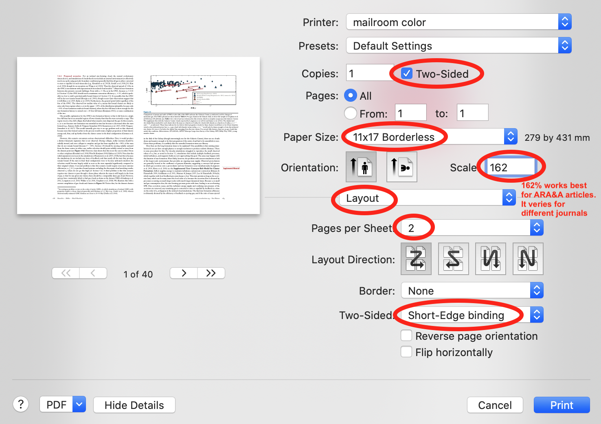

# Booklet Creator

A python script to rearrange the order of a PDF document so that when
printed in Tabloid style it reads like a book.

## Author

ChongChong He, on Nov 19, 2019. Contact: chongchong@astro.umd.edu

## Usage

```
python booklet.py path/to/PDF/file
```
which creates a new PDF file in the save folder with pages rearranged.
It will not overwrite the original PDF document.

## Steps to print a paper as a booklet
- Rearrange the PDF document you want to print using this python
  script (`booklet.py`).
- Print the PDF in Tabloid style (11 by 17 in, or 279 by 432 mm). A printer setup on macOS looks like this:
  
- Finally, folder and staple it.

## Required packages

`numpy` and `PyPDF2`
